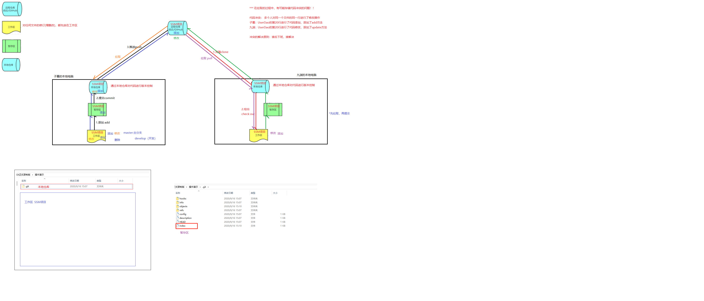

# Git

# 一、版本控制系统概述

## 1.1 应用场景

    代码备份
    代码还原（版本控制）
    协同开发
    追溯问题代码

## 1.2 版本控制系统

常见的两种版本控制类型：

- 集中式版本控制工具（SVN）
  - 集中式版本控制工具，版本仓库是集中存放在中央服务器的，team 里每个人工作时，从中央服务器下载代码。每个人修改后，提交到中央版本仓库。提交（commit）需要联网
- 分布式版本控制工具（Git）
  - 分布式版本控制系统没有“中央服务器”，每个人电脑上都是一个完整的版本仓库，这样工作的时候不需要联网。因为版本仓库就在你自己的电脑上。多人协作只需要各自修改，开发完成即可，推送给对方（联网），推送的时候是将整个版本仓库推过去。

SVN 和 Git 区别？  
git 存在本地仓库，在本地仓库实现版本控制。

## 1.3 git 工作流程

    远程仓库
    本地仓库
    暂存区
    工作区

    代码冲突：多个人对同一个文件的同一行进行了修改



## 1.4 基本概念

- 本地仓库：在本机上的一个代码仓库，可以独立存在，也可以与远程仓库进行关联。
  - 工作区：对任何文件的修订（增删改），都先放在工作区，工作区不与任何仓库分支进行关联。
  - 暂存区：把修订的文件，从工作区 add（添加）后与某一个仓库分支进行关联，只要进入缓存区的文件才能 commit（提交）到本地仓库。
- 远程仓库：在局域网或互联网上的一个主机，存放代码库的主机或平台。
- 分支：代码存放在仓库，默认是主分支（master），可以在主分支的基础上创建很多子分支。

# 二、Git 基本配置

## 2.1 基本配置

```
    git config --global user.name "your name"
    git config --global user.email "your email"

    --global：指定为全局配置，不使用该参数，则为当前仓库配置

    # 查看配置信息
    git config --list
```

```
diff.astextplain.textconv=astextplain
filter.lfs.clean=git-lfs clean -- %f
filter.lfs.smudge=git-lfs smudge -- %f
filter.lfs.process=git-lfs filter-process
filter.lfs.required=true
http.sslbackend=openssl
http.sslcainfo=C:/Program Files/Git/mingw64/ssl/certs/ca-bundle.crt
core.autocrlf=true
core.fscache=true
core.symlinks=false
credential.helper=manager-core
pull.rebase=false
credential.https://dev.azure.com.usehttppath=true
init.defaultbranch=master
user.name=YuMengMeng
user.email=whoyumengmeng@163.com
credential.helper=manager
http.sslverify=false
filter.lfs.smudge=git-lfs smudge -- %f
filter.lfs.process=git-lfs filter-process
filter.lfs.required=true
filter.lfs.clean=git-lfs clean -- %f
init.defaultbranch=main
core.repositoryformatversion=0
core.filemode=false
core.bare=false
core.logallrefupdates=true
core.symlinks=false
core.ignorecase=true
remote.origin.url=git@github.com:yumengmeng92/git_usage.git
remote.origin.fetch=+refs/heads/*:refs/remotes/origin/*
branch.main.remote=origin
branch.main.merge=refs/heads/main

```

## 2.2 构建本地仓库

- 本地初始化一个 git 仓库
- 从远程仓库克隆

## 3.3 本地仓库操作

```
# 初始化本地仓库
git init
# 查看当前文件状态
git status

On branch main
Your branch is up to date with 'origin/main'.

Untracked files: 未跟踪的文件
  (use "git add <file>..." to include in what will be committed)
        git-notes.md
        images/
        "\350\265\204\346\226\231/"

nothing added to commit but untracked files present (use "git add" to track)

# 更简洁的信息
git status -s

?? git-notes.md
?? images/
?? "\350\265\204\346\226\231/"

# 添加单个文件到暂存区
git add 文件
# 将当前目录下所有修改添加到暂存区，排除按照规则忽略的
git add .
# 如果暂存区有文件，则将其文件提交到仓库
git commit
# 带评论提交，用于说明提交内容、变更、作用等
git commit -m 'your comments'

# 查看提交记录
git log
git log --pretty=oneline

# 版本回退commit_id 指定的提交版本
git reset --hard 'commit_id'

# 回到未来的某个提交
回退到某个提交版本以后，git log不显示在这之后的提交信息
# 获取操作命令的历史
git reflog
git reset --hard 'commit_id'

# 文件未添加到暂存区，直接物理删除，如果文件已被提交
# 从暂存区删除文件
git rm 文件名

$ git rm 1.txt
error: the following file has changes staged in the index:
    1.txt
(use --cached to keep the file, or -f to force removal)


# 恢复物理删除（添加到暂存区的）的文件
git checkout 文件名


```

### 忽略列表.gitignore
```
.idea
*.iml
target

```
